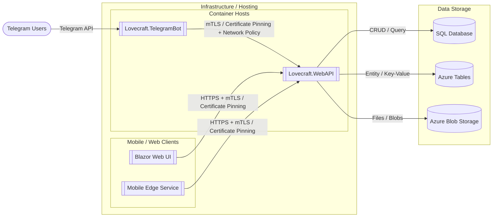

## Lovecraft System Architecture

This document contains a high-level architecture diagram and brief notes describing components and data flow for the Lovecraft system.

Notes
- The `Lovecraft.WebAPI` is the central backend containing all business logic and REST endpoints. It runs in a container and is protected — only trusted clients (services which present pinned client certificates and meet network policy rules) are allowed to call it.
- `Lovecraft.TelegramBot` is an edge service that communicates with Telegram users via the Telegram API. It authenticates to `WebAPI` using certificate pinning (client certificate) and is allowed by network policies.
- Future clients (Blazor web UI and mobile apps) will talk to `WebAPI` over HTTPS and follow the same trust model (mTLS / certificate pinning + network policies). Mobile apps may communicate via another edge service when required for push notifications or platform-specific needs.
- Data storage used by `WebAPI`:
  - `SQL Database` — relational data and transactional storage.
  - `Azure Tables` — key/value or wide-table storage for telemetry or flexible entities.
  - `Azure Blob Storage` — large binary objects, files, and content.

Security considerations / recommended controls
- Use mutual TLS (mTLS) between services; pin certificates on trusted edge services (TelegramBot, Blazor, MobileEdge).
- Enforce network policies (e.g., Kubernetes NetworkPolicy, NSG rules) so only approved service IPs or pods can reach the `WebAPI` container.
- Rotate certificates and maintain a small, auditable trust store (CA) used to issue client certs.
- Log and audit incoming requests in `WebAPI` and monitor failed auth attempts.

How to view the diagram
- On GitHub the Mermaid block will render in the web UI (if enabled) or with a Mermaid renderer extension. In VS Code install the "Markdown Preview Mermaid Support" extension or use built-in markdown preview if your VS Code supports Mermaid.

File references
- `Lovecraft.WebAPI` — backend project (see `Lovecraft.WebAPI/Program.cs` and `ConnectionCertificateAuthenticationHandler.cs`).
- `Lovecraft.TelegramBot` — Telegram edge service (see `Lovecraft.TelegramBot/Program.cs` and bot handlers).
